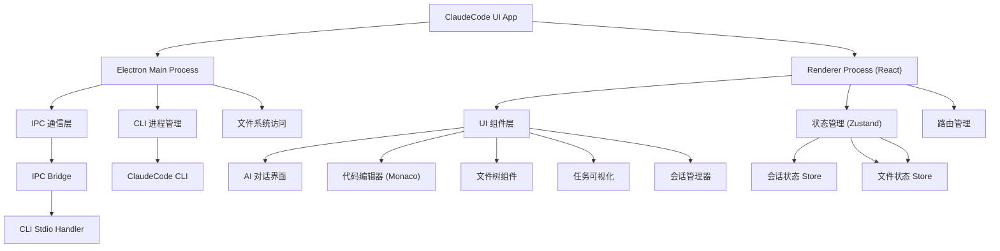

# ClaudeCode UI App - 项目架构文档

## 变更记录 (Changelog)

| 日期 | 操作 | 说明 |
|------|------|------|
| 2026-04-22 04:03:38 | 初始化 | 创建根级架构文档与模块规划 |

---

## 项目愿景

为 ClaudeCode CLI 打造现代化的桌面 UI 界面，提供类似 ChatGPT 的流畅对话体验，同时集成强大的代码编辑与文件管理能力。让 AI 辅助编程更直观、更高效。

**核心目标**：
- 降低 ClaudeCode CLI 使用门槛
- 提供可视化任务管理界面
- 支持多会话并行与历史追溯
- 实现与 CLI 的无缝双向通信

---

## 架构总览

### 技术栈

| 层级 | 技术选型 | 用途 |
|------|---------|------|
| **桌面框架** | Electron | 跨平台桌面应用容器 |
| **前端框架** | React 18+ | UI 组件与状态管理 |
| **构建工具** | Vite | 快速开发与热更新 |
| **UI 组件** | shadcn/ui | 高质量可定制组件库 |
| **样式方案** | Tailwind CSS | 原子化 CSS 框架 |
| **状态管理** | Zustand | 轻量级全局状态 |
| **代码编辑** | Monaco Editor | VS Code 同款编辑器 |
| **IPC 通信** | Electron IPC + stdio | 主进程与渲染进程通信 |
| **CLI 对接** | stdio/child_process | 与 ClaudeCode CLI 交互 |

### 架构图



---

## 模块索引

| 模块路径 | 职责 | 入口文件 | 状态 |
|---------|------|---------|------|
| [`src/main`](src/main/CLAUDE.md) | Electron 主进程 | `src/main/index.ts` | 🟡 规划中 |
| [`src/renderer/chat-ui`](src/renderer/modules/chat-ui/CLAUDE.md) | AI 对话界面 | `src/renderer/modules/chat-ui/index.tsx` | 🟡 规划中 |
| [`src/renderer/code-editor`](src/renderer/modules/code-editor/CLAUDE.md) | Monaco 编辑器集成 | `src/renderer/modules/code-editor/index.tsx` | 🟡 规划中 |
| [`src/renderer/file-tree`](src/renderer/modules/file-tree/CLAUDE.md) | 文件树组件 | `src/renderer/modules/file-tree/index.tsx` | 🟡 规划中 |
| [`src/renderer/task-viz`](src/renderer/modules/task-viz/CLAUDE.md) | 任务状态可视化 | `src/renderer/modules/task-viz/index.tsx` | 🟡 规划中 |
| [`src/renderer/session-mgr`](src/renderer/modules/session-mgr/CLAUDE.md) | 会话管理器 | `src/renderer/modules/session-mgr/index.tsx` | 🟡 规划中 |
| [`src/ipc-bridge`](src/ipc-bridge/CLAUDE.md) | IPC 通信桥接 | `src/ipc-bridge/index.ts` | 🟡 规划中 |
| [`src/stores`](src/stores/CLAUDE.md) | Zustand 状态管理 | `src/stores/index.ts` | 🟡 规划中 |
| [`src/shared`](src/shared/CLAUDE.md) | 共享类型与工具 | `src/shared/types.ts` | 🟡 规划中 |

> 🟡 规划中 = 待实现 | 🟢 已实现 | 🔧 维护中

---

## 目录结构设计

```
claudecode_ui_app/
├── src/
│   ├── main/                    # Electron 主进程
│   │   ├── index.ts             # 主进程入口
│   │   ├── ipc/                 # IPC 处理器
│   │   ├── cli/                 # CLI 进程管理
│   │   └── windows/             # 窗口管理
│   │
│   ├── renderer/                # React 渲染进程
│   │   ├── index.html           # HTML 模板
│   │   ├── main.tsx             # React 入口
│   │   ├── App.tsx              # 根组件
│   │   ├── modules/             # 功能模块
│   │   │   ├── chat-ui/         # AI 对话界面
│   │   │   ├── code-editor/     # 代码编辑器
│   │   │   ├── file-tree/       # 文件树
│   │   │   ├── task-viz/        # 任务可视化
│   │   │   └── session-mgr/     # 会话管理
│   │   ├── components/          # 通用组件
│   │   ├── hooks/               # 自定义 Hooks
│   │   └── styles/              # 全局样式
│   │
│   ├── ipc-bridge/              # IPC 通信桥接
│   │   ├── channels.ts          # 频道定义
│   │   ├── main-handlers.ts     # 主进程处理器
│   │   └── renderer-invokers.ts # 渲染进程调用器
│   │
│   ├── stores/                  # Zustand 状态管理
│   │   ├── session.ts           # 会话状态
│   │   ├── task.ts              # 任务状态
│   │   ├── file.ts              # 文件状态
│   │   └── ui.ts                # UI 状态
│   │
│   └── shared/                  # 共享代码
│       ├── types.ts             # TypeScript 类型
│       ├── constants.ts         # 常量定义
│       └── utils.ts             # 工具函数
│
├── electron.vite.config.ts      # Electron Vite 配置
├── package.json
├── tsconfig.json
├── tailwind.config.js
├── CLAUDE.md                    # 本文档
└── README.md
```

---

## 运行与开发

### 环境要求
- Node.js >= 18
- pnpm >= 8

### 初始化项目

```bash
# 安装依赖
pnpm install

# 启动开发模式
pnpm dev

# 构建 Electron 应用
pnpm build

# 打包桌面应用
pnpm package
```

### 开发命令

```bash
# 启动渲染进程开发服务器
pnpm dev:renderer

# 启动主进程开发模式
pnpm dev:main

# 类型检查
pnpm type-check

# 代码检查
pnpm lint

# 格式化代码
pnpm format
```

---

## 测试策略

### 单元测试
- 使用 Vitest 进行组件与逻辑测试
- 覆盖率目标：>= 80%

### 集成测试
- IPC 通信流程测试
- CLI 进程交互测试

### E2E 测试
- 使用 Playwright 测试 Electron 应用
- 关键用户流程覆盖

```bash
# 运行测试
pnpm test

# 测试覆盖率
pnpm test:coverage
```

---

## 编码规范

### TypeScript
- 严格模式：`strict: true`
- 使用 ES Modules
- 导入顺序：外部库 -> 内部模块 -> 相对路径

### 命名约定
- 组件：PascalCase (`ChatWindow.tsx`)
- 工具函数：camelCase (`formatMessage.ts`)
- 常量：UPPER_SNAKE_CASE (`MAX_MESSAGE_LENGTH`)
- 接口：PascalCase + I 前缀 (`IMessage`)

### 样式规范
- 优先使用 Tailwind 类名
- 复杂组件使用 CSS Modules
- shadcn/ui 组件保持默认设计

### 注释规范
- 公共 API 必须添加 JSDoc
- 复杂逻辑添加行内注释
- TODO 标记待办事项

---

## AI 使用指引

### 适合 AI 辅助的任务
- 生成基础组件代码
- 编写测试用例
- 优化性能瓶颈
- 调试 IPC 通信问题

### 关键上下文提示
- 查看模块级 `CLAUDE.md` 了解具体职责
- 参考 `src/shared/types.ts` 了解数据结构
- 查看 `src/ipc-bridge/channels.ts` 了解通信协议

### 典型工作流
1. 先阅读根级 `CLAUDE.md` 了解整体架构
2. 定位到相关模块的 `CLAUDE.md`
3. 查看入口文件与接口定义
4. 运行现有测试验证理解
5. 开始修改或扩展功能

---

## 设计理念参考

基于 0xdesign/design-plugin 的核心理念：

### 快速迭代
- 组件变体快速预览
- 热更新支持即时调整

### 并排比较
- 多会话并行展示
- 设计方案 A/B 对比

### 自动化优化
- 自动清理未使用资源
- 性能监控与优化建议

### 设计系统推断
- 从使用模式推断最佳实践
- 自动生成设计 Token

---

## 常见问题 (FAQ)

### Q: 为什么选择 Electron 而非 Tauri？
A: Electron 生态成熟，Monaco Editor 集成经验丰富，且与现有工具链兼容性好。

### Q: 如何与 ClaudeCode CLI 通信？
A: 通过 `child_process.spawn` 启动 CLI 进程，使用 stdio 进行双向数据流传输。

### Q: 状态管理为什么用 Zustand？
A: 轻量、简洁、与 React 18 并发模式兼容性好，适合中等规模应用。

### Q: 如何处理大文件加载？
A: 使用虚拟滚动 + 懒加载，Monaco Editor 内置文件分片机制。

---

## 相关资源

- [Electron 文档](https://www.electronjs.org/docs)
- [Vite Electron Builder](https://electron-vite.org/)
- [shadcn/ui 组件库](https://ui.shadcn.com/)
- [Monaco Editor 文档](https://microsoft.github.io/monaco-editor/)
- [Zustand 文档](https://github.com/pmndrs/zustand)

---

## 下一步行动

### 立即开始
1. ✅ 创建项目基础结构
2. ⬜ 配置 Vite + Electron
3. ⬜ 搭建基础 UI 布局
4. ⬜ 实现 IPC 通信骨架
5. ⬜ 集成 Monaco Editor

### 优先级排序
- **P0**: Electron 主进程 + 基础窗口
- **P0**: IPC 通信桥接
- **P1**: AI 对话界面 UI
- **P1**: CLI 进程管理与 stdio 通信
- **P2**: 代码编辑器集成
- **P2**: 会话管理器
- **P3**: 任务可视化
- **P3**: 文件树组件

---

**项目状态**: 🟡 初始化阶段
**文档版本**: v0.1.0
**最后更新**: 2026-04-22 04:03:38
